# Soccer League Project

Application to add teams, matches, see results and the status of teams in the standings.

## Database - Postgres

1. Download postgres image from dockerhub 
    > docker pull postgres
2. Run a container with the downloaded image
    > docker run --name postgres -p 5432:5432 -e POSTGRES_PASSWORD=admin1234 -d postgres
3. Start bash to postgres container
    > docker exec -it postgres bash
4. Connect to database 
    > psql -h localhost -U postgres
    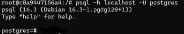
6. Connect to "postgres" db
    > \c postgres
    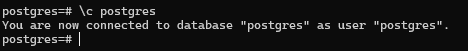
7. Create the sequences and tables, you can copy and paste the following script fragment.

    CREATE SEQUENCE team_id_seq START 1 INCREMENT BY 1;
    CREATE TABLE IF NOT EXISTS public.team
    (
        id integer NOT NULL DEFAULT nextval('team_id_seq'::regclass),
        name character varying COLLATE pg_catalog."default",
        date_created timestamp without time zone,
        last_update timestamp without time zone,
        CONSTRAINT team_pkey PRIMARY KEY (id)
    );
    CREATE SEQUENCE teams_matches_id_seq START 1 INCREMENT BY 1;
    CREATE TABLE IF NOT EXISTS public.teams_matches
    (
        id integer NOT NULL DEFAULT nextval('teams_matches_id_seq'::regclass),
        id_team1 integer,
        score_team_1 integer,
        id_team_2 integer,
        score_team_2 integer,
        match_date timestamp without time zone,
        date_created timestamp without time zone,
        last_updated timestamp without time zone,
        CONSTRAINT teams_matches_pkey PRIMARY KEY (id),
        CONSTRAINT teams_matches_id_team1_fkey FOREIGN KEY (id_team1)
            REFERENCES public.team (id) MATCH SIMPLE
            ON UPDATE NO ACTION
            ON DELETE NO ACTION,
        CONSTRAINT teams_matches_id_team_2_fkey FOREIGN KEY (id_team_2)
            REFERENCES public.team (id) MATCH SIMPLE
            ON UPDATE NO ACTION
            ON DELETE NO ACTION
    );  
8. Database Ready! 

## Websocket - Docker Deno

In the /docker_deno_websocket directory you can find the main.js file, which we will use in a bind-mount to start the socket server on a Docker Deno image.

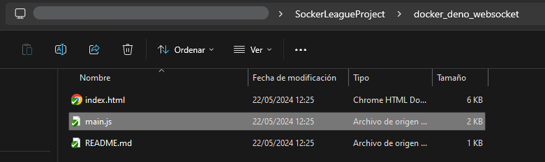

Open terminal and launch the folling command

1. Config and deploy service
    > docker run -d --init -p <HOST_PORT>:<CONTAINER_PORT> --mount type=bind,source="<FULL_PATH>/main.js",target=/app/main.js --name denosoccerapp -e PORT=<CONTAINER_PORT> denoland/deno deno run --allow-net --allow-env /app/main.js
    - You can use 5000 for each <HOST_PORT> and <CONTAINER_PORT>
    
2. Testing service
    You can use the file /docker_deno_websocket/index.html to the the socket service.    
        a. Open twice the .html file.
        b. Enter for each file page the socket en point information
        c. Connect and send message to check the service is OK
    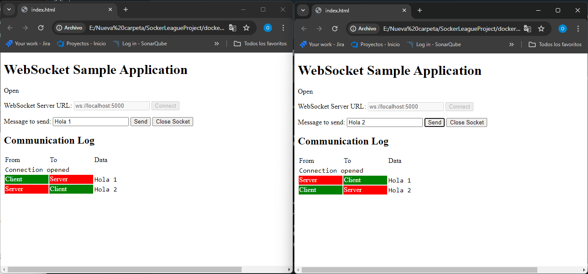
3. Socket Ready!

## Api - ASP.Net Core

1. Set the /SoccerLeague.API/appsettings.json file using your current database and socket configuration
    - "DefaultConnection": "Server=localhost:5432;User Id=postgres;Password=admin1234;Database=postgres;Pooling=false;Timeout=300;CommandTimeout=300"
    - "Socket": "ws://localhost:5000",
    ** If you have problems to connect to postgres and the socket service try using the internet ip from docker network
        - "DefaultConnection": "Server=172.17.0.2:5432;User Id=postgres..."
        - "Socket": "ws://172.17.0.3:5000",    
    a. Error in api container trying to connect to socket service
        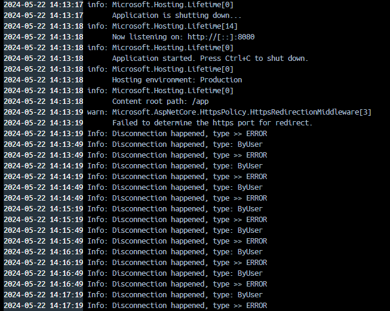
    b. Error in api trying to get teams from database
        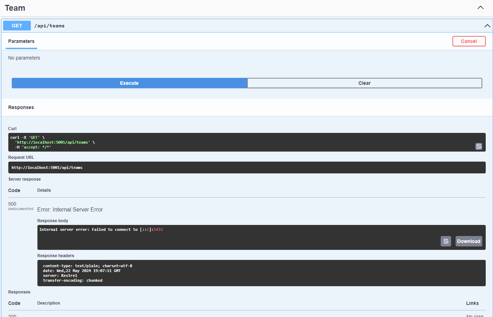
2. Build the docker image of Api using the file /soccerleagueapi.Dockerfile 
    > docker build -t soccerleagueapi . -f soccerleagueapi.Dockerfile
    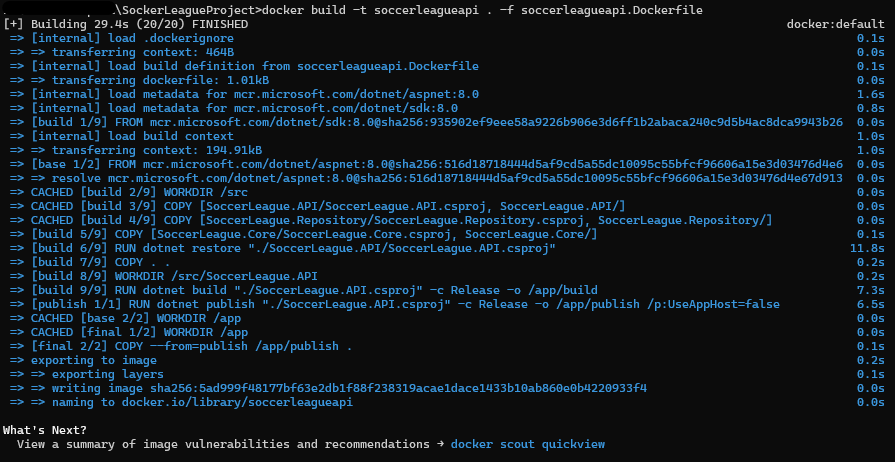
3. Run a container with the image that was created
    > docker container run -d --name soccerleagueapi -p <HOST_PORT>:8080 -e CLIENT_ORIGIN=<CLIENT_URL> soccerleagueapi
    - You can use 5001 por <HOST_PORT>
    - <CLIENT_URL> is the client origin, you can use http://localhost:5002
4. To Check the api is running successful, Go to the swagger endpoint something like this [http://localhost:5001/swagger/index.html](Localhost and port 5001)
    a. Connection with socket 
        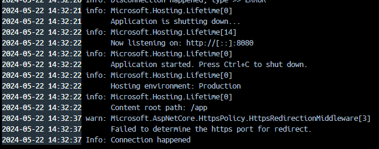
    b. Connection with database
        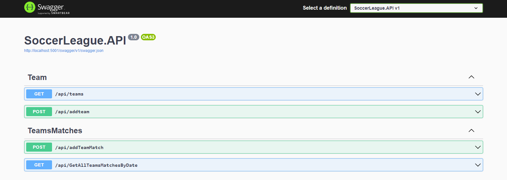
        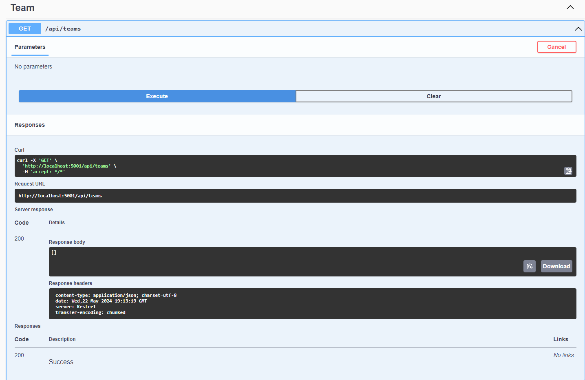
5. Api Ready!

## Client - .Net Blazor

1. Set the /SoccerLeague.Client/wwwroot/appsettings.docker.json using the api and socket endpoints you have.
    - "Api": "http://localhost:5001"
    - "Socket": "ws://localhost:5000",    
2. Build the docker image of Client using the file /soccerleagueclient.Dockerfile
    > docker build -t soccerleagueclient . -f soccerleagueclient.Dockerfile
    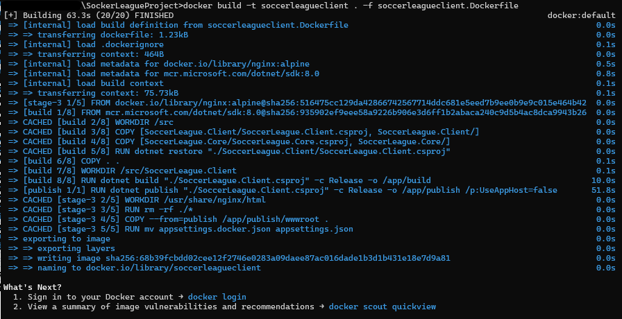
3. Run a container with the image that was created
    > docker container run -d --name soccerleagueclient -p <HOST_PORT>:80 soccerleagueclient
4. Open aplication from any browser
    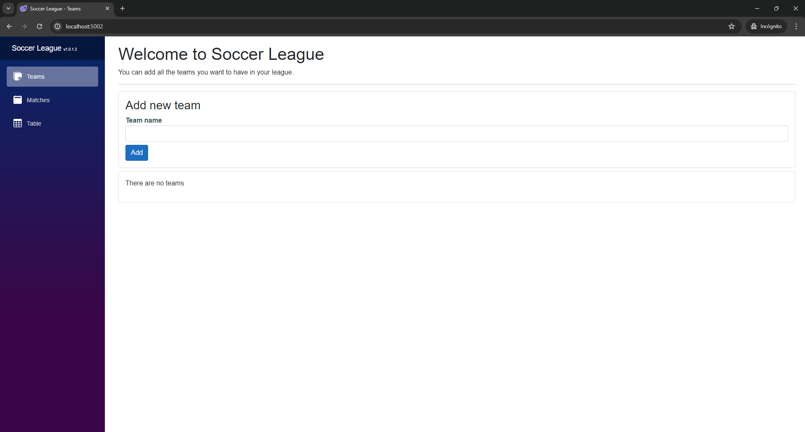
    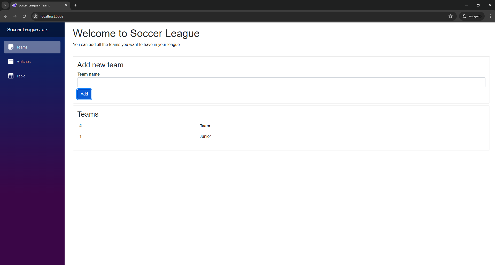
5. Client Ready! 

## Enjoy Soccer League APP
